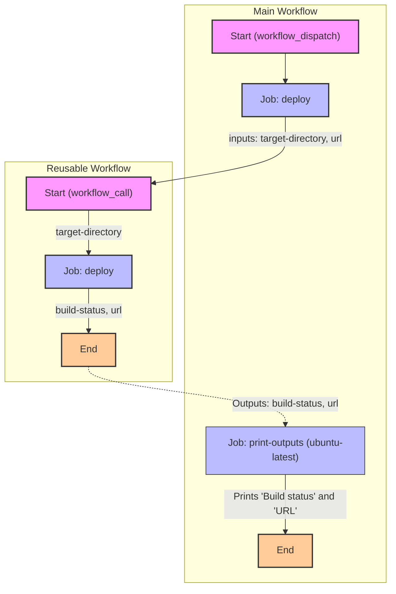

Exercise
## Objetivo
Familiarizarse con uso de flujos de trabajo reutilizables. (Reusable Workflows)

Partimos de una la idea de flujos respresentada a continuación:

## Tareas

2. Las especificaciones para el Reusable Workflow son las siguientes:   
   - Desencadenantes:
     - workflow_call: además, el desencadenador workflow_call debería aceptar un único input y producir dos outputs:
       - El input debería llamarse target-directory, ser requerido y de tipo string.
       - El primer output debería llamarse build-status, tener una descripción de 'The status of the build process', y tener el valor establecido en el output *build-status* del job *deploy* (ver instrucciones a continuación para definir el job).
       - El segundo output debería llamarse url, tener una descripción de 'The url of the deployed version', y tener el valor clave establecido en el output *url* del job *deploy* (ver instrucciones a continuación para definir el job).
   - Jobs: Tener un único job llamado *deploy* con las siguientes especificaciones:  
      - outputs:
          - build-status, tomando su valor de un output análogo del step *build*.
          - url, tomando su valor de un output análogo del step *deploy*.
      - steps:
          - Checkout repo, debería hacer checkout del código usando la acción de terceros apropiada.
          - Build, debería tener un id de build, imprimir el mensaje "Building using directory <recuperar el valor del input target-directory aquí>", y establecer el output build-status, con un valor de success.
          - Deploy, debería tener un id de deploy, imprimir el mensaje "Deploying build artifacts", y establecer el output url, con un valor de https://www.google.com.
4. Las especificaciones para el Main Workflow son las siguientes:   
   - Desencadenantes:
     - workflow_dispatch, recogiendo un valor de entrada, target-directory
   - Jobs: 
      - deploy , con las siguientes especificaciones:
        - Debería usar el flujo de trabajo "Reusable Workflow". 
        - Pasar ccomo argumento de target-directory el que recibe el Main Wf.
      - print-outputs, con las siguientes especificaciones:
        - Debería tener una dependencia del job deploy.
        - Steps: 
          - Print outputs, que imprima los siguientes dos mensajes en la pantalla:
            - "Build status: [<recuperar el output build-status del job deploy>]
            - "URL: [<recuperar el output url del job deploy>"]

## Tips

Sintaxis:
  - Usar *workflow_call* para reutilizar flujos de trabajo en otros flujos de trabajo.
  - Usar *uses* a nivel de job para reutilizar flujos de trabajo en otros flujos de trabajo.
  - Usar *outputs* a nivel de job para definir las salidas de un flujo de trabajo.
  - Usar *needs* a nivel de job para definir dependencias entre trabajos en un flujo de trabajo.

