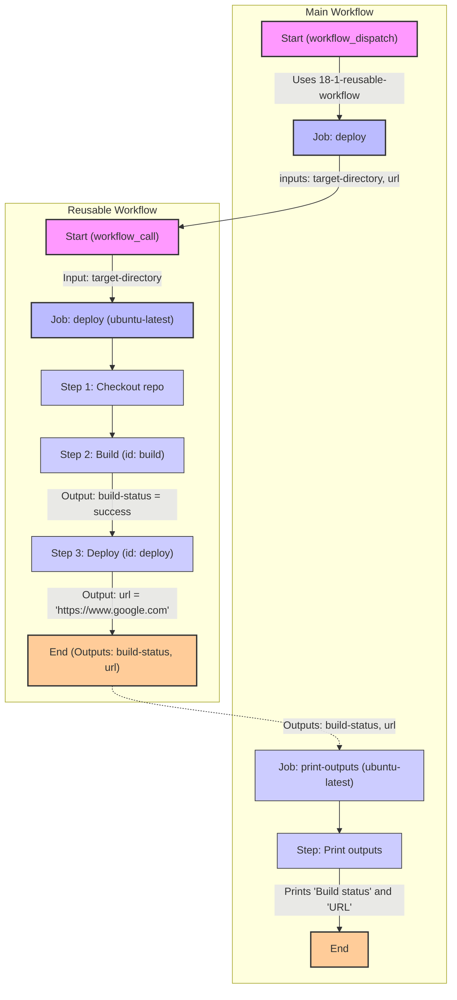

Exercise
## Objetivo
Familiarizarse con uso de flujos de trabajo reutilizables. (Reusable Workflows)

Partimos de una ide 

## Tareas

1. Crear un archivo llamado 18-1-reusable-workflow.yaml en la carpeta .github/workflows en la raíz de tu repositorio.
2. Las especificaciones del flujo de trabajo reutilizable son las siguientes:
   - Nombre: 18 - 1 - Reusable Workflows - Reusable Definition.
   - Desencadenantes:
     - workflow_call: además, el desencadenador workflow_call debería aceptar un único input y producir dos outputs:
       - El input debería llamarse target-directory, ser requerido y de tipo string.
       - El primer output debería llamarse build-status, tener una descripción de 'The status of the build process', y tener el valor establecido en el output *build-status* del job *deploy* (ver instrucciones a continuación para definir el job).
       - El segundo output debería llamarse url, tener una descripción de 'The url of the deployed version', y tener el valor clave establecido en el output *url* del job *deploy* (ver instrucciones a continuación para definir el job).
3. Añadir un único job llamado *deploy* al flujo de trabajo, con las siguientes especificaciones:
   - Debería ejecutarse en ubuntu-latest.
   - Debería definir dos outputs:
     - build-status, tomando su valor de un output análogo del step *build*.
     - url, tomando su valor de un output análogo del step *deploy*.
   - Debería contener tres steps:
     - El primer step, llamado Checkout repo, debería hacer checkout del código usando la acción de terceros apropiada.
     - El segundo step, llamado Build, debería tener un id de build, imprimir el mensaje "Building using directory <recuperar el valor del input target-directory aquí>", y establecer el output build-status, con un valor de success.
     - El segundo step, llamado Deploy, debería tener un id de deploy, imprimir el mensaje "Deploying build artifacts", y establecer el output url, con un valor de https://www.google.com.
4. Crear un nuevo archivo de flujo de trabajo llamado 18-2-reusable-workflow.yaml en la carpeta .github/workflows en la raíz de tu repositorio.
5. Las especificaciones del flujo de trabajo son las siguientes:
   - Nombre: 18 - 2 - Reusable Workflows.
   - Desencadenantes:
     - workflow_dispatch
   - Añadir un primer job llamado deploy al flujo de trabajo, con las siguientes especificaciones:
     - Debería usar el flujo de trabajo reutilizable definido anteriormente. Para ello, simplemente usa la key *uses* a nivel de job y pasa la ruta del flujo de trabajo: ./.github/workflows/18-1-reusable-workflows.yaml
     - Pasar cualquier valor como argumento de target-directory al flujo de trabajo reutilizable.
   - Añadir un segundo job llamado print-outputs al flujo de trabajo, con las siguientes especificaciones:
     - Debería ejecutarse en ubuntu-latest.
     - Debería tener una dependencia del job deploy.
     - Debería contener un único step, llamado Print outputs, que imprima los siguientes dos mensajes en la pantalla:
       - "Build status: [<recuperar el output build-status del job deploy>"
       - "URL: [<recuperar el output url del job deploy>"

6. Confirmar los cambios y hacer push del código. Desencadenar el flujo de trabajo manualmente desde la interfaz de usuario y tómate unos momentos para inspeccionar el resultado de la ejecución del flujo de trabajo.

## Tips

Sintaxis:
  - Usar *workflow_call* para reutilizar flujos de trabajo en otros flujos de trabajo.
  - Usar *uses* a nivel de job para reutilizar flujos de trabajo en otros flujos de trabajo.
  - Usar *outputs* a nivel de job para definir las salidas de un flujo de trabajo.
  - Usar *needs* a nivel de job para definir dependencias entre trabajos en un flujo de trabajo.

